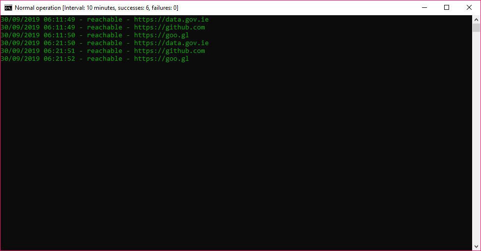

# check-http
Console program for checking website availability. Inspects HTTP response codes amongst other checks every 10 minutes. Once a failure is detected, it switches to "failure mode" where testing occurs every one minute until downtime ends.
### Usage
Pass as many FQDN's as needed as arguments. Always specify the protocol:
```
CheckHTTP https://data.gov.ie https://github.com https://goo.gl
```
### Image


Written in C# 8.0. September 2019.
